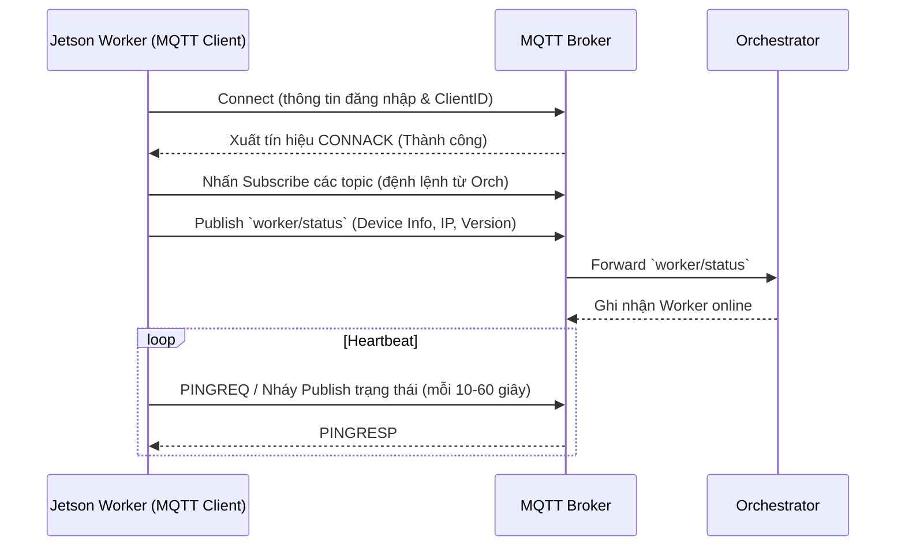
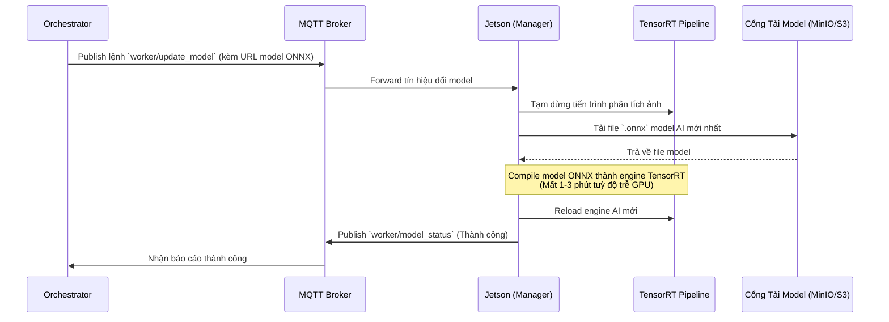
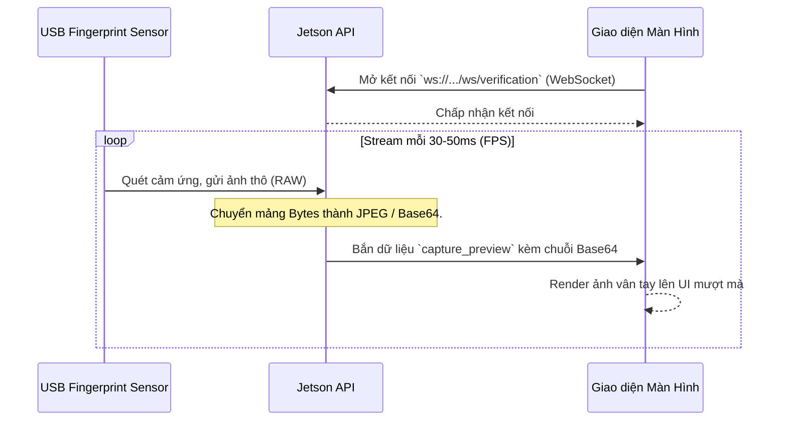
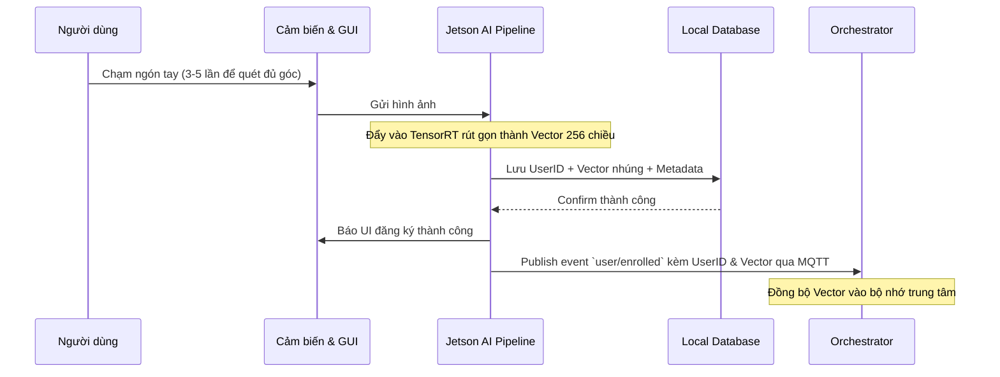
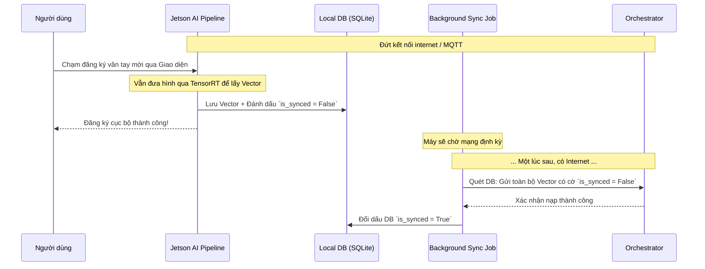
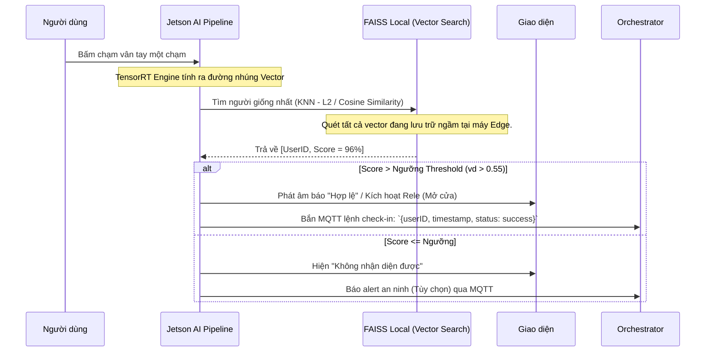

# Các Luồng Hoạt Động - Fingerprint Jetson Nano Worker

Tài liệu này mô tả chi tiết 6 luồng hoạt động cốt lõi của ứng dụng `fingerprint-jetson-nano`.

## Luồng 1: Kết nối với Orchestrator (Khởi động)

Khi ứng dụng Worker trên Jetson Nano khởi động, nó sẽ tự động kết nối với máy chủ trung tâm (Orchestrator) thông qua giao thức MQTT để thông báo trạng thái hoạt động.

## Luồng 2: Kéo Model

Khi có bản cập nhật thuật toán nhận diện vân tay mới từ chuyên gia AI, Orchestrator sẽ ra lệnh cho Jetson tải model mới xuống, biên dịch thành TensorRT và khởi động lại luồng chạy.

## Luồng 3: Streaming (Hiển thị thời gian thực)

Ngay khi màn hình cảm ứng (hoặc GUI) được bật lên, kỹ thuật Streaming qua WebSocket được áp dụng để duy trì độ trễ khung hình của vân tay cực thấp (< 50ms) cho người dùng nhìn thấy.

## Luồng 4: User Register (Đăng ký vân tay)

Luồng đăng ký người dùng mới tại trực tiếp máy Jetson Nano khi _có mạng_. Khi người dùng đăng ký xong trên máy, dữ liệu sẽ ghim thẳng sang Server qua MQTT.

## Luồng 5: User Register Trong Lúc Mất Kết Nối (Offline Mode)

Điểm mạnh của Edge AI: Nếu Jetson Nano đứt mạng (ví dụ: đứt cáp Internet), người dùng vẫn có thể đăng ký bình thường. Máy sẽ tạo cờ chờ (Queue).

## Luồng 6: User Verify (Xác thực 1:N)

Khi người dùng bình thường đập thẳng ngón tay vào để cửa mở / ra vào chấm công. Tốc độ đòi hỏi trên Edge phải siêu nhanh (dưới 0.2s).

